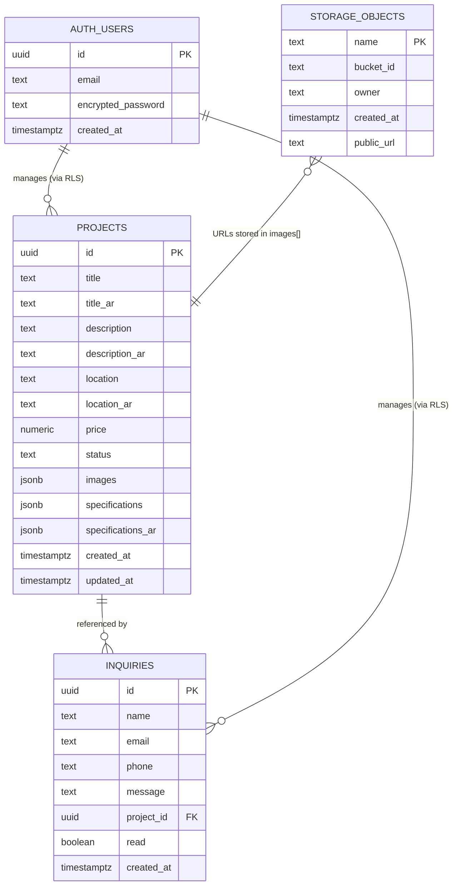

# Emera Developments — Product & Design Documentation

> **Audience:** Product owners, designers, developers onboarding to this codebase.  
> **Live site:** https://emera-developments-website.vercel.app  
> **Repository:** https://github.com/emera-developments/emera-developments-website  

---

## Table of Contents

1. [Product Overview](#1-product-overview)
2. [Goals & Success Metrics](#2-goals--success-metrics)
3. [User Personas](#3-user-personas)
4. [Information Architecture](#4-information-architecture)
5. [Page Inventory](#5-page-inventory)
6. [User Flows](#6-user-flows)
7. [Design System](#7-design-system)
8. [Data Model & ERD](#8-data-model--erd)
9. [API Reference](#9-api-reference)
10. [System Architecture](#10-system-architecture)
11. [Admin Dashboard](#11-admin-dashboard)
12. [Internationalisation](#12-internationalisation)
13. [SEO & Discoverability](#13-seo--discoverability)
14. [Deployment & Infrastructure](#14-deployment--infrastructure)
15. [Constraints & Future Considerations](#15-constraints--future-considerations)

---

## 1. Product Overview

**Emera Developments** is a premium Egyptian real estate and construction company based in Tanta, Al Gharbiyah. This website is their primary digital storefront — a bilingual (English / Arabic) marketing and lead-generation platform.

### Core purpose

| Pillar | What it does |
|---|---|
| **Showcase** | Present residential and commercial development projects with photos, specs, and status |
| **Generate leads** | Capture potential buyer inquiries via a contact form tied to specific projects |
| **Establish trust** | Communicate the brand's story, values, and track record |
| **Self-managed** | Allow the company to add, edit, and delete projects without developer involvement |

### Company details

| Field | Value |
|---|---|
| Company name | Emera Developments / إيميرا للتطوير العقاري |
| Founded | 2021 |
| Location | 24 El Fateh St, Tanta, Al Gharbiyah, Egypt |
| Email | emera.developments@gmail.com |
| Phone / WhatsApp | +2010 03144282 |
| Instagram | [@emera_development](https://www.instagram.com/emera_development/) |
| Facebook | [emera_development](https://www.facebook.com/profile.php?id=61571683641952) |
| Map coordinates | 30.792874, 30.990704 |

---

## 2. Goals & Success Metrics

### Primary goals

1. **Capture inquiries** — Every project page ends with a clear call-to-action to submit an inquiry. Inquiries are stored in the database and surfaced in the admin dashboard.
2. **Build brand authority** — High-quality visual presentation positions Emera as a premium developer in a competitive market.
3. **Reach Arabic-speaking audience** — Full RTL support and Arabic content for the primary Egyptian market.
4. **Zero developer dependency for content** — The admin dashboard enables non-technical staff to manage the entire portfolio.

### Success indicators

| Metric | Signal |
|---|---|
| Inquiry submissions | Primary conversion event |
| Portfolio page depth | Users browsing multiple projects |
| Admin session frequency | Team actively updating the site |
| Bounce rate on project pages | Image quality and copy engagement |

---

## 3. User Personas

### Persona A — The Prospective Buyer

```
Name:       Ahmed Kamal
Age:        38
Location:   Tanta / Cairo
Device:     Mobile-first (Android)
Language:   Arabic preferred, comfortable with English
Goals:      Find a residential property to buy or invest in;
            understand price range, location, and specs
Behaviour:  Browses Instagram → clicks link → views portfolio →
            opens a project → submits inquiry
Pain points: Slow sites; no clear way to contact; uncertainty about
            availability; no Arabic content
```

### Persona B — The Business Partner / Investor

```
Name:       Sarah Mansour
Age:        45
Location:   Cairo / abroad (Gulf, Europe)
Device:     Desktop
Language:   English preferred
Goals:      Evaluate Emera as a development partner or
            investment vehicle; verify legitimacy
Behaviour:  Google search → About page → Portfolio → Contact
Pain points: Lack of portfolio evidence; no company story; no
            visible contact details
```

### Persona C — The Site Admin (Emera Staff)

```
Name:       Internal team member
Device:     Desktop (Windows laptop)
Goals:      Add new projects when launched; read and respond to
            inquiries; update project status (available → sold)
Behaviour:  Login → Dashboard → Add/edit projects → Check inquiries
Pain points: Complex CMS tools; needing a developer for every change
```

---

## 4. Information Architecture

### Public site map

```
/                           Home
├── /portfolio              Project listing (filterable)
│   └── /projects/:id       Individual project detail
├── /about                  Company story & values
├── /contact                Contact form + map + social links
└── /ar/*                   Arabic mirrors of all above routes
    ├── /ar/
    ├── /ar/portfolio
    ├── /ar/projects/:id
    ├── /ar/about
    └── /ar/contact
```

### Admin site map

```
/admin/login                Authentication gate
/admin/dashboard            Stats overview + quick actions
/admin/projects             Project list (CRUD)
│   ├── /admin/projects/new    Create project
│   └── /admin/projects/:id   Edit project
└── /admin/inquiries        Inquiry list (read/delete)
```

### Route strategy

- **i18n strategy:** `prefix_except_default` — English routes have no prefix (`/portfolio`), Arabic routes are prefixed (`/ar/portfolio`).
- **Auth guard:** All `/admin/*` routes redirect to `/admin/login` if no authenticated Supabase session exists. The public site, API routes, and sitemap are explicitly excluded from this guard.

---

## 5. Page Inventory

### Public pages

#### `/` — Home

The primary marketing and brand landing page. Sections in order:

| Section | Purpose |
|---|---|
| **Hero** | Full-viewport dark background with GSAP-animated headline, two CTAs (Portfolio / Contact), scroll indicator |
| **Stats** | Social proof numbers (projects delivered, units, years of experience, satisfaction rate) |
| **Featured Projects** | 3-card preview of the latest projects pulled from the database |
| **About teaser** | Brief company mission statement with CTA to About page |
| **CTA banner** | Dark section pushing users to Contact |

- Splash screen (`SplashScreen.vue`) plays on first load; animated logo on black, fades out.
- `useSeoMeta()` sets Open Graph title, description, and image.

#### `/portfolio` — Portfolio

Full project listing with client-side filtering.

| Element | Detail |
|---|---|
| **Filter bar** | Tabs: All / Available / Sold / Coming Soon — each shows count |
| **Project grid** | Responsive card grid using `ProjectCard.vue` |
| **Empty state** | Shown when no projects exist or filter yields zero results |
| **Transition** | Vue `<TransitionGroup>` animates cards in/out on filter change |

#### `/projects/:id` — Project Detail

Single project deep-dive page.

| Section | Detail |
|---|---|
| **Gallery** | `ProjectGallery.vue` — primary image with scrollable thumbnail row, thumbnail click switches main image |
| **Sidebar (desktop)** | Status badge, location, no pricing (by design), centered "Inquire" CTA linking to `/contact?project=:id` |
| **Description** | Full text in current locale |
| **Specifications** | Key-value table from `specifications` / `specifications_ar` JSON |
| **Related projects** | 3 other projects from the same dataset |

#### `/about` — About

Brand story page. Sections:

| Section | Detail |
|---|---|
| Hero | Dark banner with company headline |
| Story | Two-column layout with image and narrative copy |
| Values | 4-card grid: Quality, Integrity, Innovation, Community |
| Stats | Repeated metrics bar |
| CTA | Gold CTA linking to Contact |

GSAP ScrollTrigger powers fade-in animations on each section.

#### `/contact` — Contact

Lead capture and company information page.

| Element | Detail |
|---|---|
| **Contact form** | Name, Email, Phone (optional), Project (dropdown from live data), Message — submits to `/api/inquiries` |
| **Google Maps embed** | Iframe centred on `30.792874, 30.990704` (Tanta office) |
| **Contact cards** | Phone, Email, WhatsApp, Address — each card is a tap/click action |
| **Social links** | Instagram, Facebook, WhatsApp icons in footer and contact section |

#### `/ar/*` — Arabic routes

All public pages are available under the `/ar/` prefix with:
- Full Arabic translations loaded from `i18n/locales/ar.json`
- `dir="rtl"` on the layout root
- Cairo font applied via `font-arabic` class
- Logical CSS properties (`ms-*`, `me-*`, `ps-*`, `pe-*`, `start-*`, `end-*`) used throughout for automatic RTL flip

### Admin pages

Covered in detail in [Section 11](#11-admin-dashboard).

### Special routes

| Route | Type | Purpose |
|---|---|---|
| `/sitemap.xml` | Server route | Dynamically generated XML sitemap including all project URLs in both locales |
| `/robots.txt` | Static file | Disallows `/admin/` crawling; references sitemap |
| `/confirm` | Supabase callback | Auth redirect destination after email confirmation |

---

## 6. User Flows

### Flow 1 — Prospective buyer discovers and inquires

```
Instagram / Google
      │
      ▼
  Home (/)
      │  clicks "View Portfolio"
      ▼
 Portfolio (/portfolio)
      │  clicks a project card
      ▼
 Project Detail (/projects/:id)
      │  clicks "Inquire About This Project"
      ▼
 Contact (/contact?project=:id)
      │  project pre-selected in dropdown
      │  fills name, email, phone, message
      │  clicks "Send Inquiry"
      ▼
 POST /api/inquiries
      │
      ▼
 Success toast shown
 Row created in `inquiries` table
```

### Flow 2 — Admin reads an inquiry and follows up

```
/admin/login
      │  enters email + password
      │  Supabase authenticates
      ▼
/admin/dashboard
      │  sees "X unread" badge on Inquiries card
      ▼
/admin/inquiries
      │  reads message, name, email, phone
      │  clicks email icon → opens mail client (mailto:)
      │  or clicks WhatsApp externally
      │  clicks checkmark → marks as read
      ▼
 PATCH /api/admin/inquiries/:id  { read: true }
```

### Flow 3 — Admin publishes a new project

```
/admin/projects  →  "New Project" button
      │
      ▼
/admin/projects/new
  Section 1: English content (title, description, location, status)
  Section 2: Arabic translation
  Section 3: Upload photos via AdminImageUploader
      │  each file → POST /api/admin/upload → Supabase Storage
      │  returned URL appended to images array
  Section 4: Specifications (EN key-value pairs)
  Section 5: Specifications (AR key-value pairs)
      │
      │  clicks "Publish Project"
      ▼
 POST /api/admin/projects
      │
      ▼
 Redirected to /admin/projects
 Project immediately visible on public portfolio
```

### Flow 4 — Language toggle

```
Any page (EN)
      │  clicks language toggle in Navbar
      ▼
 switchLocalePath('ar') resolves equivalent AR path
 router.push(localised path)
      ▼
 Same page re-rendered in Arabic / RTL
```

---

## 7. Design System

### Brand identity

| Token | Value |
|---|---|
| Primary accent | Gold (`#c49a2e` / `gold-500`) |
| Background dark | `gray-950` (`#030712`) |
| Background light | `white` / `gray-50` |
| Text primary | `gray-900` |
| Text muted | `gray-500` |
| Success | `emerald-600` |
| Danger | `red-600` |

### Gold palette

Only three shades of gold are used sitewide — no Tailwind defaults (`yellow-*`, `amber-*`) and no custom `brand-*` colours in templates.

| Token | Hex | Usage |
|---|---|---|
| `gold-400` | `#d4a843` | Subtle accents, focus rings, hover text |
| `gold-500` | `#c49a2e` | Primary buttons, badges, active states |
| `gold-600` | `#a67f20` | Hover state for gold-500 elements |

### Typography

| Role | Font | Weight |
|---|---|---|
| Display / headings | Playfair Display (serif) | 400, 600, 700 |
| Body / UI | Inter (sans-serif) | 300, 400, 500, 600, 700 |
| Arabic content | Cairo | 300, 400, 500, 600, 700 |

All fonts loaded from Google Fonts via `<link>` in `nuxt.config.ts` app head.

Font utility classes:
- `font-sans` → Inter + Cairo fallback
- `font-display` → Playfair Display + Cairo fallback
- `font-arabic` → Cairo only (applied to `dir="rtl"` content)

### Spacing & layout

- Max content width: `max-w-7xl` (1280px) with `px-4 sm:px-6 lg:px-8` gutter
- Navbar height: `h-20` (80px) — pages using default layout add `pt-20` to avoid overlap
- Card radius: `rounded-2xl` throughout
- Section vertical padding: `py-16 lg:py-24`

### Component inventory

| Component | File | Notes |
|---|---|---|
| `SplashScreen` | `components/SplashScreen.vue` | First-visit animated logo reveal on black |
| `Navbar` | `components/Navbar.vue` | Transparent on home hero, white elsewhere; collapses to hamburger at `lg` breakpoint |
| `Footer` | `components/Footer.vue` | Dark bg, logo, nav links, contact details, social icons (SVG) |
| `ProjectCard` | `components/ProjectCard.vue` | Cover image, title, location, status badge, gold "Inquire" link |
| `ProjectGallery` | `components/ProjectGallery.vue` | Main image + thumbnail strip, active thumbnail has gold border |
| `ContactForm` | `components/ContactForm.vue` | Validated form, project dropdown, gold submit button |
| `AdminSidebar` | `components/admin/AdminSidebar.vue` | Fixed sidebar with SVG icons, active route highlighting |
| `AdminNav` | `components/admin/AdminNav.vue` | Top bar showing current admin user email + sign-out |
| `AdminImageUploader` | `components/admin/ImageUploader.vue` | Multi-file upload, reorder arrows, cover badge, progress indicators |

### Motion & animation

GSAP v3 with ScrollTrigger is used for entrance animations. All GSAP imports are dynamic (`import('gsap')`) to avoid SSR hydration issues.

| Page | Animation |
|---|---|
| Home hero | Staggered fade-up: badge → title → subtitle → CTA → scroll indicator |
| Home stats | Counter-up numbers on scroll |
| About | ScrollTrigger fade-in per section |
| All pages | Vue `<Transition>` / `<TransitionGroup>` for route changes and list reordering |

### Responsive breakpoints

| Breakpoint | px | Key behaviour change |
|---|---|---|
| `xs` | 375 | Custom Tailwind breakpoint |
| `sm` | 640 | 2-column grids |
| `md` | 768 | 4-column stats grid |
| `lg` | 1024 | Navbar hamburger → full links; 2-column about layout |
| `xl` | 1280 | Wider content containers |

---

## 8. Data Model & ERD

### Entity Relationship Diagram



### Table: `projects`

| Column | Type | Constraints | Description |
|---|---|---|---|
| `id` | `uuid` | PK, default `uuid_generate_v4()` | Unique project identifier |
| `title` | `text` | NOT NULL | English title |
| `title_ar` | `text` | nullable | Arabic title |
| `description` | `text` | nullable | English long description |
| `description_ar` | `text` | nullable | Arabic long description |
| `location` | `text` | nullable | English location string |
| `location_ar` | `text` | nullable | Arabic location string |
| `price` | `numeric(12,2)` | nullable | Price in EGP; intentionally hidden from public UI |
| `status` | `text` | NOT NULL, CHECK in (`available`, `sold`, `coming_soon`) | Availability state |
| `images` | `jsonb` | default `[]` | Ordered array of Supabase Storage public URLs; first element is the cover photo |
| `specifications` | `jsonb` | default `{}` | English key-value pairs (e.g. `{ "Units": "120", "Floors": "22" }`) |
| `specifications_ar` | `jsonb` | default `{}` | Arabic key-value pairs |
| `created_at` | `timestamptz` | default `now()` | Creation timestamp |
| `updated_at` | `timestamptz` | auto-updated via trigger | Last modification timestamp |

### Table: `inquiries`

| Column | Type | Constraints | Description |
|---|---|---|---|
| `id` | `uuid` | PK, default `uuid_generate_v4()` | Unique inquiry identifier |
| `name` | `text` | NOT NULL | Submitter's full name |
| `email` | `text` | NOT NULL | Submitter's email address |
| `phone` | `text` | nullable | Submitter's phone number |
| `message` | `text` | nullable | Free-text inquiry body |
| `project_id` | `uuid` | FK → `projects(id)` ON DELETE SET NULL | Which project this inquiry is about; nullable (general inquiries) |
| `read` | `boolean` | default `false` | Whether admin has read the inquiry |
| `created_at` | `timestamptz` | default `now()` | Submission timestamp |

### Row Level Security (RLS)

| Table | Operation | Policy | Condition |
|---|---|---|---|
| `projects` | SELECT | Public read projects | `true` (anyone) |
| `projects` | INSERT / UPDATE / DELETE | Admin write projects | `auth.role() = 'authenticated'` |
| `inquiries` | INSERT | Public submit inquiry | `true` (anyone) |
| `inquiries` | SELECT / UPDATE / DELETE | Admin manage inquiries | `auth.role() = 'authenticated'` |

All server-side admin API routes additionally verify the session via `serverSupabaseUser(event)` and throw `401 Unauthorized` if unauthenticated — RLS is a second defence layer.

### Storage: `project-images` bucket

- **Type:** Public bucket (URLs are publicly accessible without auth)
- **File naming:** `{timestamp}-{randomAlphanumeric}.{ext}` — collision-resistant, no path structure
- **Allowed types:** `jpg`, `jpeg`, `png`, `webp`, `avif`
- **Max size:** 5 MB per file
- **Access:** Upload via authenticated admin API only (`POST /api/admin/upload`); read publicly via CDN URL

---

## 9. API Reference

All routes are Nitro server routes under `server/api/`. Public routes use `useSupabaseAdmin()` (service role, bypasses RLS). Admin routes additionally check `serverSupabaseUser(event)`.

### Public endpoints

#### `GET /api/projects`
Returns all projects ordered by `created_at DESC`.

**Response:** `Project[]`

---

#### `GET /api/projects/:id`
Returns a single project by UUID.

**Response:** `Project`  
**Errors:** `404` if not found

---

#### `POST /api/inquiries`
Submits a new inquiry from the contact form.

**Body:**
```json
{
  "name": "string (required)",
  "email": "string (required)",
  "phone": "string (optional)",
  "message": "string (required)",
  "projectId": "uuid (optional)"
}
```

**Response:** `{ success: true }`  
**Errors:** `400` if name / email / message missing

---

### Admin endpoints (auth required)

All admin endpoints return `401` if no valid Supabase session cookie is present.

#### `GET /api/admin/stats`
Returns dashboard summary counts.

**Response:**
```json
{
  "totalProjects": 12,
  "availableProjects": 7,
  "unreadInquiries": 3
}
```

---

#### `POST /api/admin/upload`
Uploads a single image to Supabase Storage.

**Content-Type:** `multipart/form-data`  
**Field:** `file`

**Response:** `{ "url": "https://...supabase.co/storage/v1/object/public/project-images/..." }`  
**Errors:** `400` bad file / size exceeded; `500` storage error

---

#### `POST /api/admin/projects`
Creates a new project.

**Body:** Full project fields (all optional except `title`)  
**Response:** Created `Project`

---

#### `PUT /api/admin/projects/:id`
Updates an existing project.

**Body:** Partial or full project fields  
**Response:** Updated `Project`

---

#### `DELETE /api/admin/projects/:id`
Permanently deletes a project. Associated inquiries' `project_id` is set to NULL (cascades via FK definition).

**Response:** `{ success: true }`

---

#### `GET /api/admin/inquiries`
Returns all inquiries with the associated project title joined (`*, projects(title)`), ordered by `created_at DESC`.

**Response:** `Inquiry[]` (each includes `projects: { title: string } | null`)

---

#### `PATCH /api/admin/inquiries/:id`
Toggles read status.

**Body:** `{ "read": boolean }`  
**Response:** Updated `Inquiry`

---

#### `DELETE /api/admin/inquiries/:id`
Permanently deletes an inquiry.

**Response:** `{ success: true }`

---

### Special routes

#### `GET /sitemap.xml`
Dynamically generated XML sitemap. Queries all projects and outputs URLs for both `/projects/:id` (EN) and `/ar/projects/:id` (AR). Falls back to `NUXT_PUBLIC_SITE_URL` env var, then hardcodes production URL.

---

## 10. System Architecture

```
┌─────────────────────────────────────────────────────────────────┐
│                         BROWSER / CLIENT                        │
│                                                                 │
│  Vue 3 SPA hydrated from SSR HTML                               │
│  Pinia stores (projects, inquiries)                             │
│  GSAP animations (dynamic import, client-only)                  │
│  i18n (en/ar), Vue Router, Nuxt composables                     │
└────────────────────────┬────────────────────────────────────────┘
                         │ HTTP (SSR: internal; CSR: fetch)
┌────────────────────────▼────────────────────────────────────────┐
│                    VERCEL EDGE / SERVERLESS                      │
│                                                                 │
│  Nuxt 4 SSR (Nitro engine)                                      │
│  ├── SSR page rendering (public pages)                          │
│  ├── Client-only rendering (admin pages — server: false)        │
│  ├── API routes (server/api/**)                                 │
│  └── Server route: /sitemap.xml                                 │
└────────────────────────┬────────────────────────────────────────┘
                         │ Supabase JS client (service role)
┌────────────────────────▼────────────────────────────────────────┐
│                         SUPABASE                                │
│                                                                 │
│  PostgreSQL database                                            │
│  ├── projects table (RLS enabled)                               │
│  └── inquiries table (RLS enabled)                              │
│                                                                 │
│  Auth (email + password)                                        │
│  └── Single admin user: emera.developments@gmail.com           │
│                                                                 │
│  Storage                                                        │
│  └── project-images bucket (public CDN)                        │
└─────────────────────────────────────────────────────────────────┘
```

### Environment variables

| Variable | Used by | Description |
|---|---|---|
| `SUPABASE_URL` | Server + client | Supabase project URL |
| `SUPABASE_KEY` | Client (anon) | Public anon key — safe to expose |
| `SUPABASE_SERVICE_KEY` | Server only | Service role key — **never expose to client** |
| `NUXT_PUBLIC_SITE_URL` | Sitemap route | Production domain for sitemap URLs |

Variables are set in `.env` locally (gitignored) and in Vercel project settings for production.

### Request lifecycle — public page (e.g. `/portfolio`)

```
1. User navigates to /portfolio
2. Vercel serverless function handles request
3. Nuxt SSR renders portfolio.vue
4. onMounted fires client-side → store.fetchProjects()
5. $fetch('/api/projects') → Nitro API handler
6. useSupabaseAdmin() queries PostgreSQL
7. Returns JSON array to client
8. Pinia store populated → Vue reactivity updates DOM
```

### Request lifecycle — admin page (e.g. `/admin/projects`)

```
1. User navigates to /admin/projects
2. @nuxtjs/supabase middleware checks session cookie
3. Valid session → page renders (shell only; server: false)
4. Client hydrates → useAsyncData fires client-side
5. $fetch('/api/projects') with session cookie
6. Nitro checks serverSupabaseUser(event) → valid → query runs
7. Data returned → table populated
```

---

## 11. Admin Dashboard

The admin dashboard is a full CRUD interface for managing the public-facing content. It is accessible only to authenticated users.

### Authentication

- Provider: Supabase email + password
- Single admin account: `emera.developments@gmail.com`
- Session managed via Supabase Auth cookies (handled by `@nuxtjs/supabase`)
- Session expires automatically; Supabase handles token refresh

### Dashboard sections

#### Overview (`/admin/dashboard`)

| Stat | Source |
|---|---|
| Total Projects | `COUNT(*)` on `projects` |
| Available Listings | `COUNT(*) WHERE status = 'available'` |
| Unread Inquiries | `COUNT(*) WHERE read = false` on `inquiries` |

Quick-action cards link directly to "Add New Project" and "View Inquiries".

#### Projects (`/admin/projects`)

- Table listing all projects with thumbnail, title, Arabic title, location, status badge
- Status badge colours: Available → emerald, Coming Soon → amber, Sold → grey
- Actions per row: **Edit** (pencil icon) → `/admin/projects/:id`; **Delete** (trash icon) → confirmation modal before DELETE call
- "New Project" button (top right) → `/admin/projects/new`

#### New / Edit Project form

5-section form:

| # | Section | Fields |
|---|---|---|
| 1 | English Content | Title (required), Description, Location, Status |
| 2 | Arabic Translation | Title (AR), Description (AR), Location (AR) — all RTL |
| 3 | Photos | `AdminImageUploader` — multi-upload, reorder, cover designation |
| 4 | Specifications (EN) | Dynamic key-value rows |
| 5 | Specifications (AR) | Dynamic key-value rows (RTL) |

**Image uploader behaviour:**
- Each file uploads immediately on selection via `POST /api/admin/upload`
- Progress indicator per file
- First image in the array is the cover photo (shown with "Cover" badge)
- Left/right arrows reorder images
- × button removes an image from the list
- All image URLs stored as a JSON array in `projects.images`

**Edit page specifics:**
- Pre-populated via `GET /api/projects/:id` (client-side fetch, `server: false`)
- Watches returned data and populates `reactive` form fields
- "Save Changes" shows a 3-second success banner on completion

#### Inquiries (`/admin/inquiries`)

- Unread inquiries highlighted with gold border and "New" badge
- Each card shows: name, "New" badge if unread, project reference, email, phone (if provided), date, message
- Actions: **Toggle read** (eye/check icon), **Reply** (opens mailto: link), **Delete** (confirmation modal)
- "Mark all as read" button appears when any inquiry is unread
- `formatDate` uses `Intl.DateTimeFormat` with `en-EG` locale

---

## 12. Internationalisation

### Setup

- Module: `@nuxtjs/i18n` v9
- Strategy: `prefix_except_default` (English = no prefix; Arabic = `/ar/` prefix)
- Detection: Cookie-based (`i18n_locale`), redirects on root visit only
- Locale files: `i18n/locales/en.json` and `i18n/locales/ar.json`

### Arabic / RTL implementation

| Concern | Solution |
|---|---|
| Text direction | `dir="rtl"` on `<html>` via layout `app.vue` |
| Spacing | Tailwind logical properties: `ms-`, `me-`, `ps-`, `pe-`, `start-`, `end-` |
| Font | Cairo loaded from Google Fonts; applied via `font-arabic` class |
| Admin dashboard | Always LTR (`dir="ltr"` on admin layout) — fixed interface, not content |
| Language toggle | `Navbar.vue` calls `switchLocalePath` + `router.push` |

### Translation keys structure

```
nav.*          Navigation link labels
hero.*         Homepage hero section
splash.*       Splash screen tagline
footer.*       Footer labels
contact.*      Contact form labels
portfolio.*    Portfolio page labels and filter tabs
project.*      Project detail labels (status, specs, etc.)
```

---

## 13. SEO & Discoverability

### Meta tags

The home page uses `useSeoMeta()` for structured Open Graph tags:
- `og:title`, `og:description`, `og:image`, `og:type`, `og:url`
- `twitter:card` set to `summary_large_image`

Other pages use `useHead({ title: '...' })` for tab titles.

### Sitemap

`/sitemap.xml` is dynamically generated on each request:
- Queries all projects from the database
- Emits `<url>` entries for every project in both English (`/projects/:id`) and Arabic (`/ar/projects/:id`)
- Includes static pages: `/`, `/portfolio`, `/about`, `/contact` and their `/ar/` counterparts
- `<lastmod>` derived from `project.updated_at`
- `<changefreq>monthly` for projects, `weekly` for home/portfolio

### robots.txt

```
User-Agent: *
Disallow: /admin/

Sitemap: https://emera-developments-website.vercel.app/sitemap.xml
```

Admin routes are excluded from crawling; all public content is indexable.

---

## 14. Deployment & Infrastructure

### Stack summary

| Layer | Technology |
|---|---|
| Framework | Nuxt 4 (v4.4.8) |
| Runtime | Vue 3.5 + TypeScript |
| Styling | Tailwind CSS v3 |
| State | Pinia v3 (manual plugin — no @pinia/nuxt) |
| Animation | GSAP v3 + ScrollTrigger |
| i18n | @nuxtjs/i18n v9 |
| Backend | Nitro (built into Nuxt) |
| Database + Auth | Supabase (PostgreSQL + GoTrue) |
| Storage | Supabase Storage |
| Hosting | Vercel (auto-deploy on push to `master`) |
| Source control | GitHub (`emera-developments/emera-developments-website`) |

### Deployment pipeline

```
Local development
      │  git push origin master
      ▼
GitHub
      │  Vercel webhook triggered
      ▼
Vercel build
  nuxt build
  Output: .output/ (Nitro server bundle)
      │
      ▼
Vercel serverless deployment
  Production URL: https://emera-developments-website.vercel.app
```

**No CI test suite** — deployments are triggered directly on every push to `master`. All environment variables must be set in Vercel project settings before the first deploy.

### Vercel environment variables (required)

Set these under: Vercel Dashboard → Project → Settings → Environment Variables

| Key | Value source |
|---|---|
| `SUPABASE_URL` | Supabase project settings → API |
| `SUPABASE_KEY` | Supabase anon/public key |
| `SUPABASE_SERVICE_KEY` | Supabase service role key |
| `NUXT_PUBLIC_SITE_URL` | `https://emera-developments-website.vercel.app` (or custom domain) |

### Local development

```bash
# Install dependencies
npm install

# Start dev server
npm run dev
# → http://localhost:3000

# Build for production
npm run build

# Preview production build locally
npm run preview
```

Requires a `.env` file at the project root (see `.env.example`).

---

## 15. Constraints & Future Considerations

### Current constraints

| Constraint | Details |
|---|---|
| Single admin user | Only one Supabase auth user exists. Multiple staff would require adding users in Supabase Auth. |
| No image deletion from storage | Removing a project or replacing an image leaves orphaned files in the `project-images` bucket. A cleanup job or soft-delete policy would address this. |
| Price hidden by design | `price` column exists in the DB but is intentionally not shown to public users. Pricing is shared only through direct inquiry. |
| No project pagination | All projects are fetched at once. Pagination or infinite scroll would be needed beyond ~50 projects. |
| No inquiry email notifications | Inquiries are stored in the database but no email is sent to the admin. Supabase Edge Functions or a webhook could trigger an email alert. |
| No image optimisation | Images are served as uploaded from Supabase CDN. Next-gen format conversion and responsive sizes are not applied automatically. |
| About page content is hardcoded | The story, values, and stats on the About page are hardcoded in the template. A dedicated CMS section or a settings table in Supabase would make this manageable. |

### Recommended next improvements

| Priority | Feature | Effort |
|---|---|---|
| High | Email notification on new inquiry | Low — Supabase webhook → Resend/SendGrid |
| High | Custom domain on Vercel | Low — DNS configuration |
| Medium | Inquiry email-reply templates | Medium |
| Medium | About page editable from admin | Medium — new `settings` table |
| Medium | Image deletion when project deleted | Medium — cascade storage cleanup in DELETE handler |
| Low | Project pagination | Medium — cursor-based query |
| Low | Analytics integration | Low — Vercel Analytics or Plausible |
| Low | WhatsApp deep-link on project page | Low — pre-filled message with project name |
